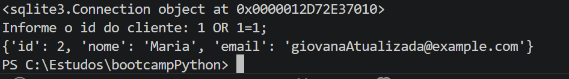
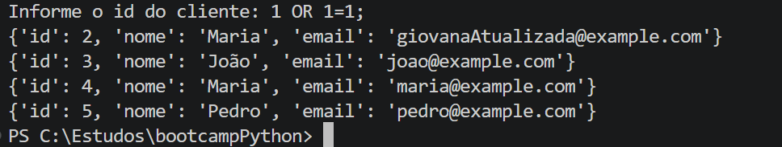

## Segurança
- Evitar a concatenação de strings nas consultas e usar consultas parametrizadas;
- Previne ataques de injeção SQL.

 Exemplo do injecao_sql.py

- Exemplo do fetchone().
- Fazendo injeção SQL.
Cliente 1 nem existe mas retorna o registro de id = 2 quando passado um input malicioso.

- exemplo do fetchall().
- Fazendo uma injeção SQL, nesse caso poderia ter uma dado sensível que não deveriamos poder visualizar mas conseguiriamos fazendo isso.