# Classes o objetos

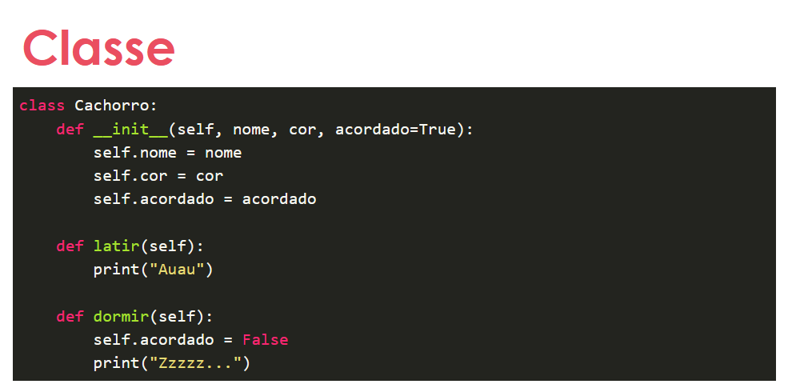

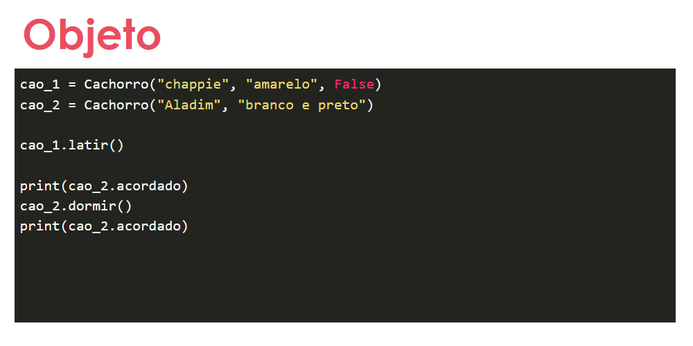

# Construtores e destrutores

__init__ >> construtor da classe;

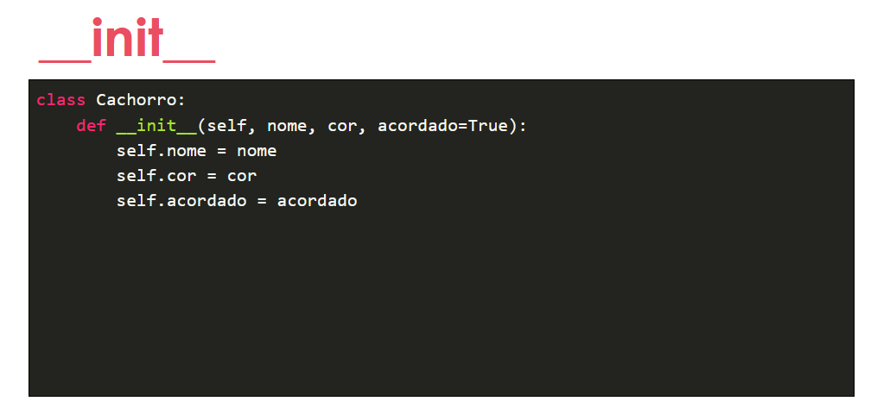

---
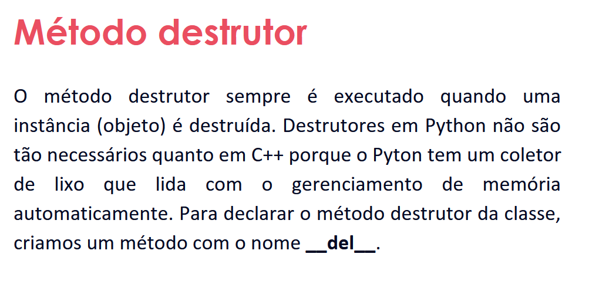

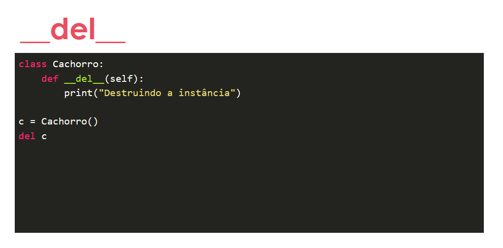

# Herança

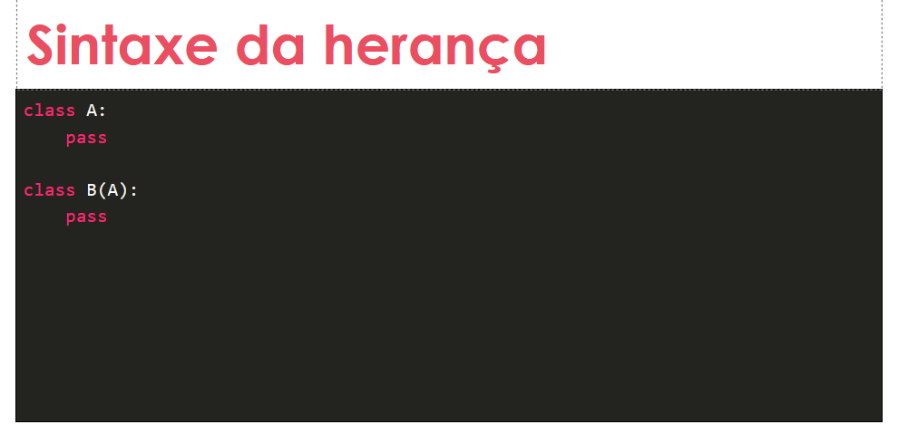

Em **Python** existe ***herança múltipla***:

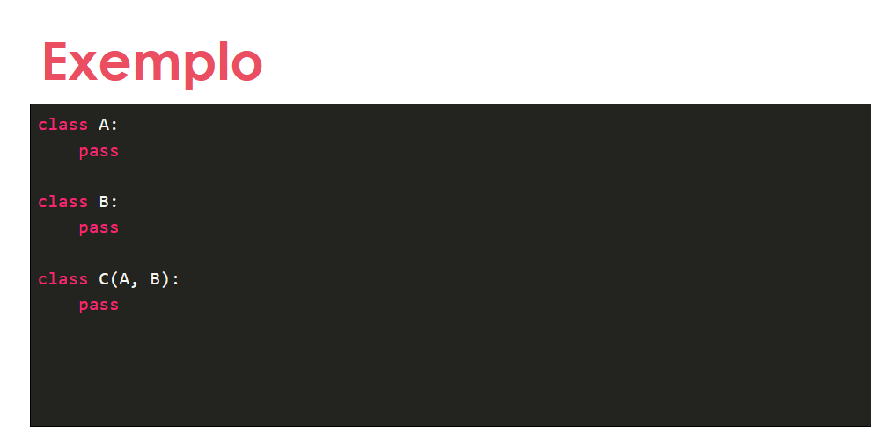

# Encapsulamento 

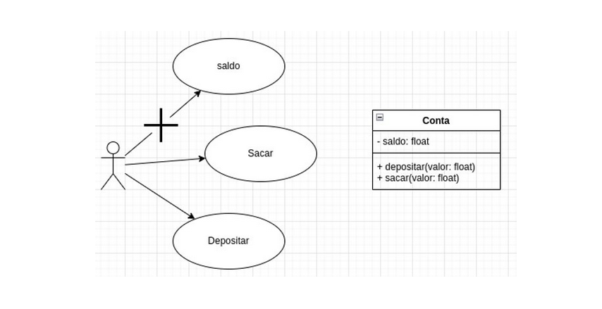

Mais do mesmo, restringir o que não faz sentido que outros tenham acesso evitando assim um problema futuramente.

# Modificadores de acesso 

Em python, não temos palavras reservadas, porém usamos convenções no nome do recurso, para definir se a variável é pública ou privada.  

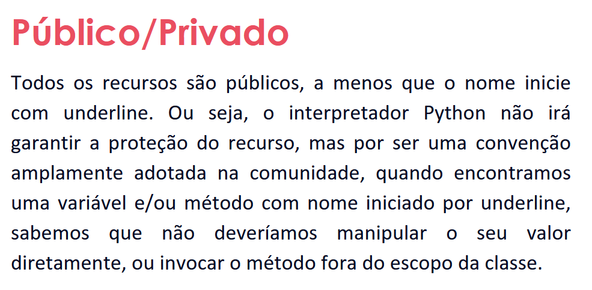

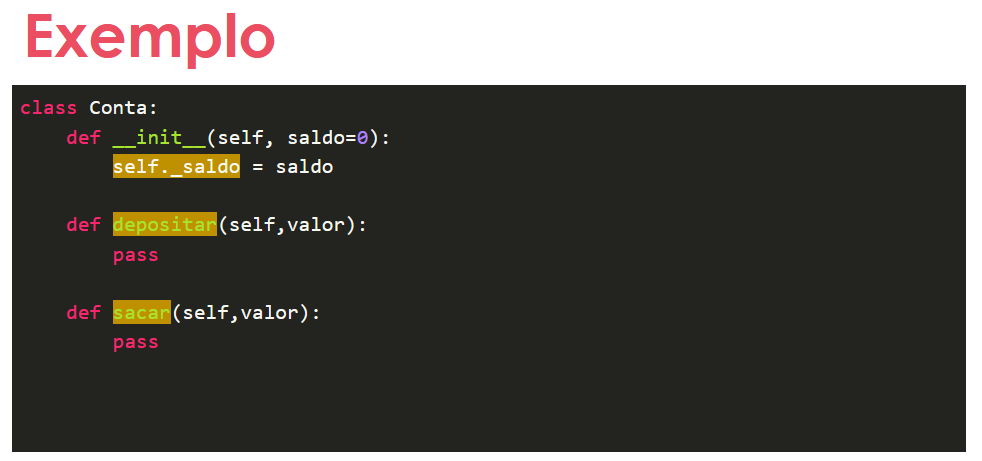

# Properlies

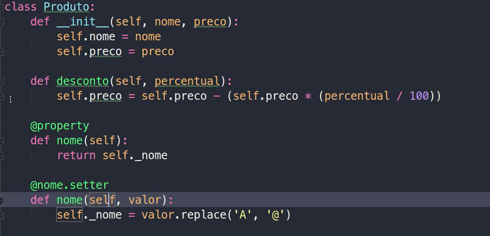

https://www.youtube.com/watch?v=PGXwNophTOQ 
Mais Info.

# Classes abstratas

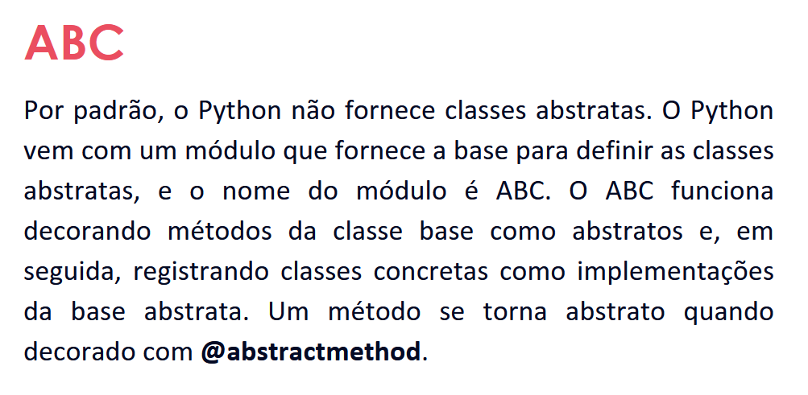

# Interfaces

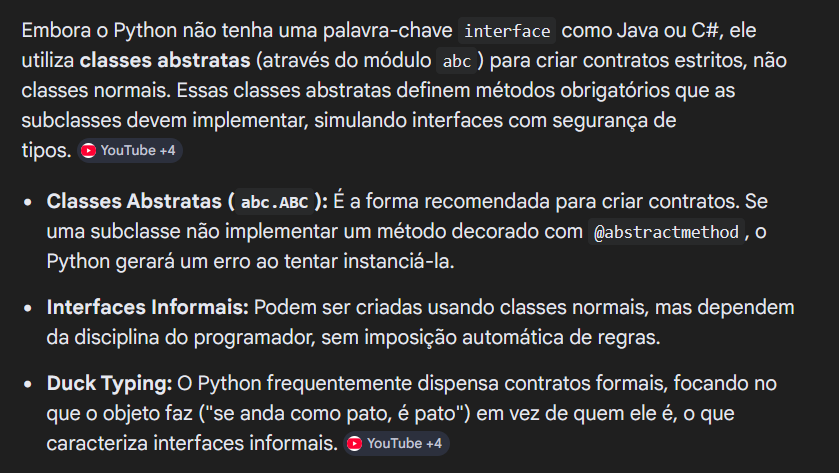

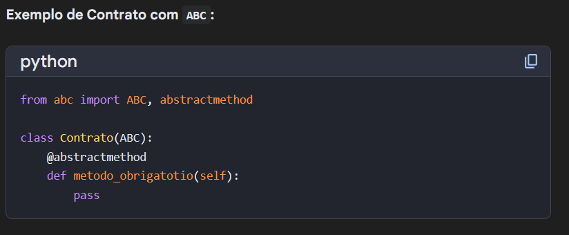

# Desafio

Neste desafio iremos atualizar a implementação do sistema bancário, para armazenar os dados de clientes e contas bancárias em objetos ao invés de dicionários. O código deve seguir o modelo de classes UML.

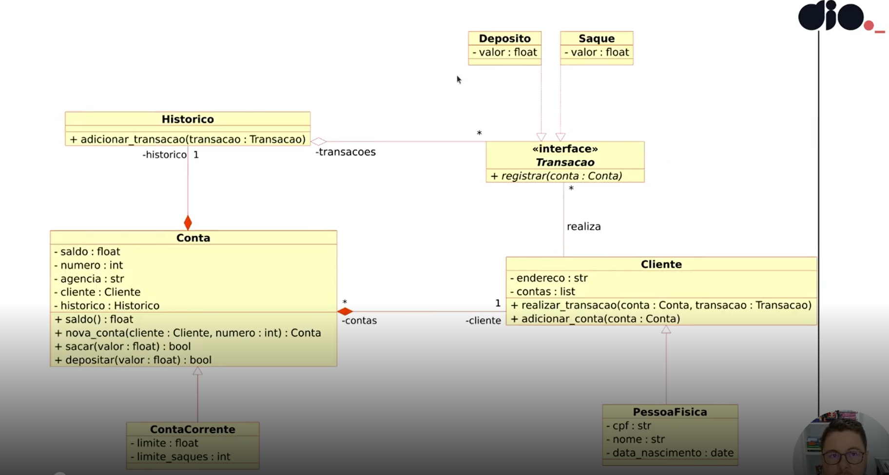